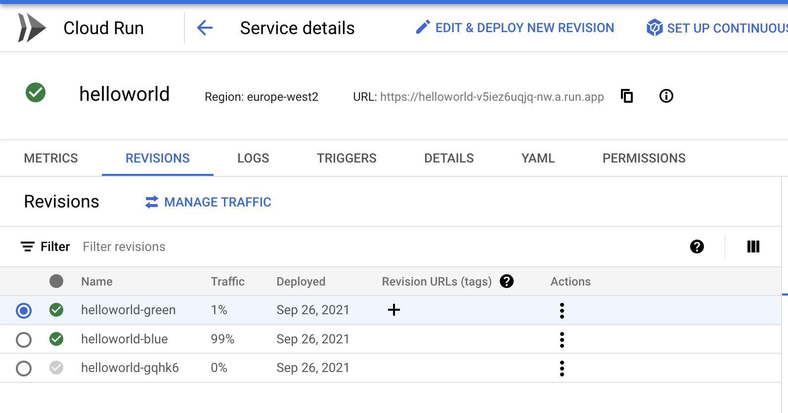

## Getting started with Cloud Run
Google cloud run is a fully managed compute platform for running containerized applications on the cloud.
The best serverless solution for containerized applications at this moment is Cloud Run in my opinion. Yes, its better then AWS Lambda (as of now) particularly because of its easiness, excellent containerized support and seamless integration with Kubernetes (GKE with Knative) and cheaper also. 

## 2 Simple Steps

#### Build and push the container image
Assuming you have already containerized the application e.g. Dockerfile is ready and tested locally. If the image is tagged and built locally you can just directly push the image to GCR directly e.g.

```bash
docker tag busybox gcr.io/my-project/busybox
docker push gcr.io/my-project/busybox
```

or you can also use Cloud Build to build the image for you and push to GCR e.g. 

```bash
gcloud builds submit --tag gcr.io/my-project/busybox .
```

#### Deploy to Cloud Run
We could either deploy from Cloud Shell, your local terminal or directly from Container Registry Interface in google cloud console.

```bash
gcloud beta run deploy --image gcr.io/y-project/busybox
```

## Tips
Cloud Run allows multiple deployment strategies e.g. Blue-Green, Rolling, Canary
e.g. in the following diagram I am using a new revision to slowly add traffic to it by easily managing traffic from Cloud Run console. 



## Conclusion

Cloud Run is a great simple solution for running applications. It does not allow you to do a lot of configurations which makes it simple and less prone to errors. One disadvantage is that the nodes are managed by Google itself so in case of issues with underlying infrastructure you can't change nodes etc or move it to new nodes quickly, you have to completey rely in Google. But there will be very few times you may face issue with Google on underlying infrastructure (although I have had that experience).

[back](../)