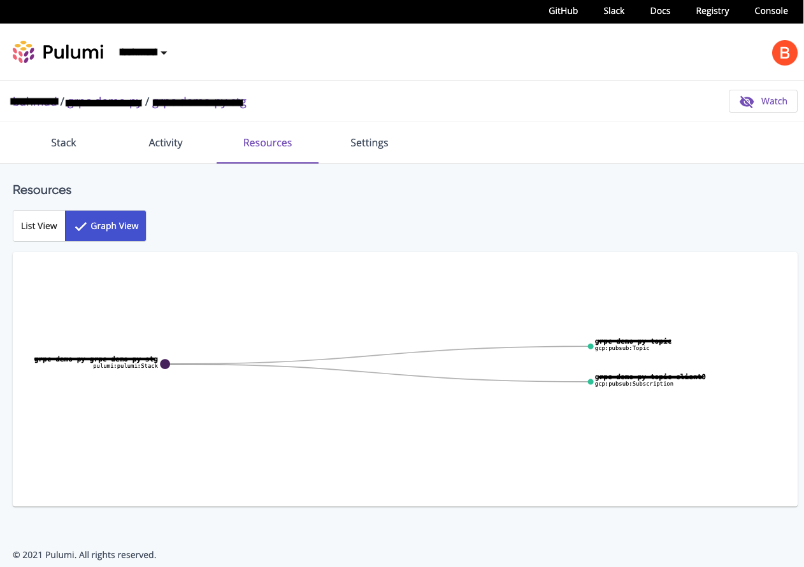
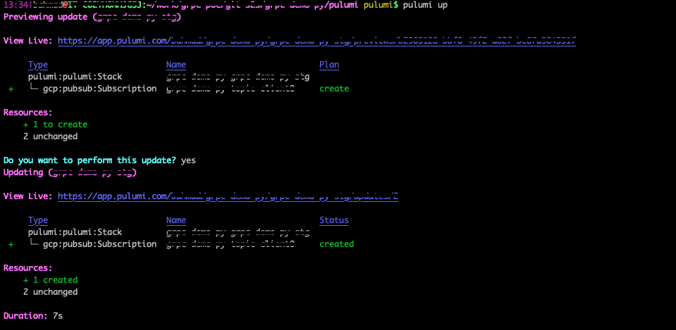

### No wonder Pulumi is getting a lot of traction, Its Great!

AWS CDK is really good but its only for AWS, while Pulumi works for multiple cloud providers. So we rule out CDK at the start.

Now for a long time if you wanted a good Infrastructure-as-a-code tool that works for multiple cloud providers, you had one option: 'The Hashicorp Terraform'. It is based on HCL and it did a pretty good job in all fairness and still does. But it lacks a few things which Pulumi has solved. E.g. HCL is difficult and awkward language for infrastructure-as-a-code, It's not very developer friendly and it does not have a fancy UI. With Pulumi, you get the fancy UI and you can code in Python,Java or any developer friendly language and it also takes care of managing your state of infrastructure, you dont have to manage it yourself (although sometimes its a good idea to manage your state yourself and Pulumi allows it too).

If you ever had to use a conditional expression in terraform, you would know what a pain in the butt it can be. E.g.

```bash
x != "" ? x : "default"
```
If `x` is an empty string then the result is `default`, else it is the actual value of `x`

Now same thing Pulumi can be done with the simple python if/else or switch statement or whatever you feel comfortable in.
It supports all the major languages Python, Go, Nodejs. 
It has support for a lot of platforms listed here [https://www.pulumi.com/registry/]([https://www.pulumi.com/registry/]).

The really good part about Pulumi is its great UI. It shows the state of Infrastructure in a list view and Graph view. It allows you to see the multiple stacks in a project as an admin. and multiple projects in an organization. Also allows you to set Pulumi tags which can be utilized for your internal organization logic. You can also see pulumi stack secrets and configurations from UI.



Now lets see how we can add the code and deploy with Pulumi:

Here is an example where we are adding a Google Cloud PubSub Topic and Subscription in Python. 

```python
 """A Google Cloud Python Pulumi program"""

 import pulumi
 import pulumi_gcp as gcp

 example_topic = gcp.pubsub.Topic("my-app-topic")

 example_subscription = gcp.pubsub.Subscription("my-app-subscription-a",
     topic=example_topic.name,
     ack_deadline_seconds=20
     )
```

Even great part is that this pulumi code can reside inside the backend application repository itself. E.g. the backend application repository is in python and create a folder for pulumi which can have pulumi configuration and its main files. This way its easier to manage the infrastructure and code of any application from a single repository.

Now to deploy the application you simply do the `pulumi up` which shows you the changes and if you choose `yes` it goes ahead and applies it.



The state can either be managed by you or pulumi service can take of that for you. So if you hand it over to pulumi to take care you dont even have to worry about storing state and then locking it if multiple members of team does apply at same time.

Pulumi also has great integrations for continuos deployment of your infrastructure code. You can see the list of supported platforms here [https://www.pulumi.com/docs/guides/continuous-delivery/](https://www.pulumi.com/docs/guides/continuous-delivery/).


[back](../)